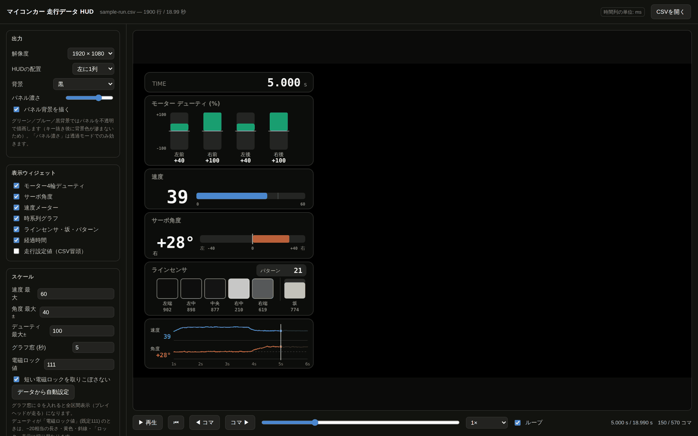
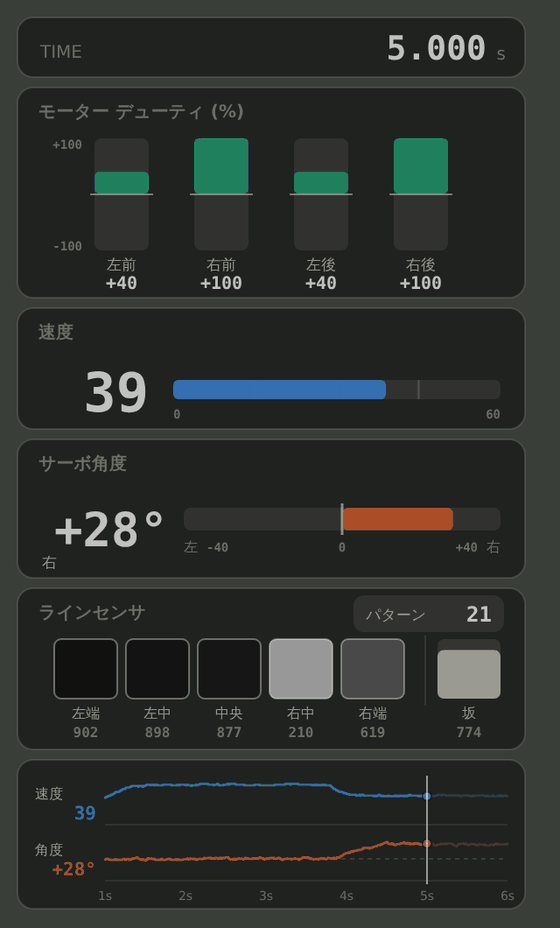
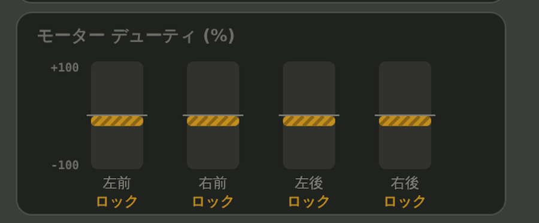
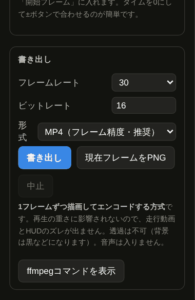

# マイコンカー 走行データ HUD

**公開URL → https://krkdo.github.io/linetrace-run-hud/**（ブラウザで開くだけ。インストール不要）

マイコンカーが走行中に記録した CSV ログを読み込むと、速度・サーボ角度・モーターのデューティ・ラインセンサの値が、時間に合わせて動く計器パネル（HUD）になります。
撮影した走行動画を並べて、フレーム単位でぴったり同期させることができます。
最後は MP4 として書き出せるので、そのまま SNS や発表資料に使えます。

<!-- スクリーンショット①：アプリ全体。CSVと走行動画を読み込んだ状態 -->


---

## これは何をするもの？

マイコンカーは、コース上の白線（ライン）をセンサで読み取りながら、自分で判断して走る小型のロボットカーです。マイコンカーラリーという競技で使われます。走行中はマイコンが「今どのくらいの速度か」「ハンドル（サーボ）を何度切ったか」「モーターをどのくらいの強さで回したか」といった値を、**10ミリ秒ごと**に記録しています。

その記録（CSV ファイル）は数字がびっしり並んだ表なので、眺めても走りのイメージが湧きません。このツールは、その数字を**動く計器パネル**に変えて、走行動画の横に並べます。「このカーブで減速している」「ここでブレーキをかけた」といったことが、映像を見ながら一目で分かるようになります。

**こんな人向け**

- マイコンカーラリーに取り組んでいる人（部活動・工業高校・高専・企業チームなど）
- 走行の様子を動画にして、部内や大会、SNS で共有したい人
- 走行ログを見ながら、プログラムの改善点を探したい人

---

## できること

| | 機能 | 説明 |
|---|---|---|
| 📄 | **CSV の自動読み込み** | 列名を見て自動で項目を判別します。文字コード（UTF-8 / Shift_JIS）も自動判定 |
| 🎛 | **6つの計器パネル** | 経過時間・モーターデューティ・速度・サーボ角度・ラインセンサ・時系列グラフ |
| ⚡ | **電磁ロックの強調表示** | デューティ 111（電磁ブレーキ）を黄色＋斜線で表示。10ms しかない一瞬のロックも取りこぼしません |
| ⬛ | **センサの明暗表示** | 値が小さいほど白、大きいほど黒。路面の見え方がそのまま分かります |
| 🎬 | **走行動画との合成** | 空いたスペースに動画を配置。開始フレームを指定してデータと同期させます |
| 🎯 | **フレーム単位の同期** | 動画の fps を自動判定。コマ送りボタンで1コマずつ位置合わせできます |
| 💾 | **MP4 書き出し** | 1コマずつ描いてエンコードするので、PCの重さに関係なくズレません |
| 🎞 | **透過 PNG 連番の書き出し** | 編集ソフトで自由に重ねたい場合はこちら。背景が透明のまま書き出せます |
| 🟩 | **グリーンバック出力** | クロマキー合成用。背景を緑・青・黒から選べます |

すべてブラウザの中だけで動きます。**動画も走行データも、どこかのサーバーに送られることはありません。**

---

## 使い方

### 1. 走行データを読み込む

1. [https://krkdo.github.io/linetrace-run-hud/](https://krkdo.github.io/linetrace-run-hud/) を Google Chrome で開きます
2. 走行ログの CSV ファイルを、画面の中央にドラッグ＆ドロップします
3. 計器が表示されたら成功です。下の再生ボタンで動きを確認できます

まず試したいときは、このリポジトリの [`samples/sample-run.csv`](samples/sample-run.csv) を使ってください（動作確認用のサンプルデータです）。

<!-- スクリーンショット②：HUD部分の拡大 -->


### 2. 走行動画を重ねる

1. 左のサイドバー「走行動画」の **動画を開く** から、撮影した動画を選びます（ドラッグ＆ドロップでも可）
2. 動画の fps は自動で判定されます
3. **開始フレーム** に、データの 0 秒に対応する動画のフレーム番号を入れます

**位置合わせのコツ**：タイムを 0 秒にしてから、開始フレームの `−10 / −1 / +1 / +10` ボタンを押して、走り出しの瞬間に合わせてください。再生バーの右端に「動画 90 f」のように、今表示している動画のフレーム番号が出ます。

### 3. 書き出す

1. サイドバー「書き出し」で形式を選びます
2. **書き出し** ボタンを押します

| 形式 | どんなとき | 備考 |
|---|---|---|
| **MP4（フレーム精度・推奨）** | そのまま完成動画にしたい | 1コマずつ描くのでズレません。音声は入りません |
| **PNG連番 ZIP（透過）** | 編集ソフトで自由に重ねたい | 背景が透明。最高画質 |
| **MP4（等倍録画・音声入り）** | 動画の音も入れたい | 再生しながら収録するため、PCが重いと数コマずれることがあります |

書き出しには実時間より時間がかかります（17秒の動画で1〜2分程度）。進捗バーが動いていれば処理中です。

<!-- スクリーンショット③：電磁ロック表示 -->


---

## 対応する CSV の形式

先頭に設定値の行が数行あり、その後に `時間` から始まる見出し行が続く形式です。見出し行より前の行は「走行設定」として表示されます。

```
距離 STOP_DISTANCE68000
直線速度 sp055
レーンチェンジ速度 lcspeed47
時間,パターン,角度,左前,右前,左後,右後,速度,左端,左中,中央,右中,右端,坂
0,11,0,100,100,100,100,0,777,633,97,541,851,766
10,11,0,100,100,100,100,1,772,624,99,557,858,765
```

| 列名 | 内容 | 単位・範囲の例 |
|---|---|---|
| `時間` | 記録した時刻 | **ミリ秒(ms)**。10ms 間隔を想定 |
| `パターン` | 走行パターン番号 | 整数 |
| `角度` | サーボ角度 | 度。マイナスが左、プラスが右 |
| `左前` `右前` `左後` `右後` | 各車輪のモーターデューティ | %。マイナスは逆転。**111 は電磁ロック** |
| `速度` | 速度 | 整数 |
| `左端` `左中` `中央` `右中` `右端` | ラインセンサ5ch | 値が小さいほど白、大きいほど黒 |
| `坂` | 坂センサ | 整数 |

- 列の順番が違っても、**列名で自動的に判別**します
- 使わない列があっても構いません
- 時間が 0 から始まっていなくても、自動的に先頭を 0 秒として扱います

---

## 動作環境

- **Google Chrome（推奨）** または Microsoft Edge の新しいバージョン
- Windows / macOS どちらでも動きます
- インストール作業は不要です

MP4 の書き出しには WebCodecs という比較的新しいブラウザ機能を使っています。対応していないブラウザでは、その旨を表示して PNG 連番での書き出しをご案内します。Safari や Firefox では一部の書き出し形式が使えない場合があります。

---

## 開発者向け：手元で動かす・改造する

このアプリは **`index.html` 1つだけ**で動きます。ライブラリは一切使っていないので、追加インストールは必要ありません。

### 手元で開く

いちばん簡単な方法は、`index.html` をダブルクリックして Chrome で開くことです。それだけで全機能が使えます。

ローカルサーバーで動かしたい場合（Node.js 18 以上が必要）：

```bash
git clone https://github.com/KRKDO/linetrace-run-hud.git
cd linetrace-run-hud
npm start
```

`http://localhost:8080/` をブラウザで開いてください。終了は `Ctrl + C` です。

### コマンド一覧

| コマンド | 何をするか |
|---|---|
| `npm start` | ローカルサーバーを起動（`http://localhost:8080/`） |
| `npm run check` | `index.html` が壊れていないか確認 |
| `npm run build` | 公開用ファイルを `dist/` にまとめる |

**依存パッケージはゼロ**なので `npm install` も不要です（`node_modules` フォルダは作られません）。

### ファイル構成

```
linetrace-run-hud/
├── index.html                    アプリ本体（これ1つで動きます）
├── samples/sample-run.csv        動作確認用のサンプルデータ
├── screenshots/                  README用の画像
├── tools/serve.mjs               ローカルサーバー
├── tools/build.mjs               チェック＆公開用ファイル作成
├── .github/workflows/deploy.yml  GitHub Pages への自動公開設定
├── package.json
├── .gitignore
└── LICENSE
```

### 公開の仕組み

`main` ブランチに変更を保存（コミット）すると、GitHub Actions が自動的に GitHub Pages へ公開します。1〜2分ほどで反映されます。進行状況はリポジトリの **Actions** タブで確認できます。

<!-- スクリーンショット④：書き出し設定のサイドバー -->


---

## よくある質問

**Q. 走行データや動画は外部に送信されますか？**
いいえ。すべてブラウザの中だけで処理しています。ネットに接続していなくても、ページを一度開いた後なら動きます。

**Q. 書き出した MP4 が動画とずれます**
「MP4（フレーム精度）」を選んでいるか確認してください。「等倍録画」はPCの負荷でずれることがあります。それでもずれる場合は、動画の fps と開始フレームの設定を見直してください。

**Q. センサの値が黒いままで見えません**
このツールは「値が小さい＝白、大きい＝黒」で表示します。黒地に白線のコースを走る前提の表示です。逆のコースの場合は読み替えてください。

**Q. 自分のマシンのログは列名が違います**
`index.html` の中の `COLS` という部分に列名の一覧があります。ここを書き換えれば対応できます。

---

## ライセンス

[MIT License](LICENSE) — 自由に使い、改造し、再配布できます。

---

## 作者

[@KRKDO](https://github.com/KRKDO)

改善案や不具合の報告は [Issues](https://github.com/KRKDO/linetrace-run-hud/issues) までお願いします。
